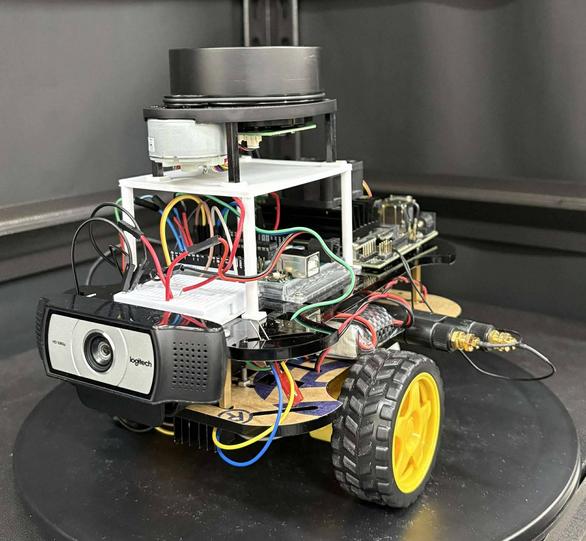

# 🚗 Jetbot Self-Driving Car



[<video controls width="600">
  <source src="./demo.mp4" type="video/mp4">
  Your browser does not support the video tag.
</video>](https://github.com/user-attachments/assets/828a5b6e-d7d7-46b5-a1ad-34fc8aba68cd)


---

## 🖥️ Environment

* **Ubuntu** : 18.04.6 LTS
* **ROS** : melodic
* **CUDA** : 10.2
* **Python** : 3.6.9 (default version on Jetson Nano)

---

## 🧰 Hardware

* **Nvidia Jetson Nano 4GB**
* **Arduino Uno**
* **Logitech USB 2D Camera**
* **RPi LiDAR A1**
* **DC Motors ×2**
* **L298N Motor Driver**
* **DC Power Bank**

---

# 🧪 Training Environment Setup (ScaledYOLOv4 + CUDA)

> Training is done on a desktop GPU (RTX series). Jetson Nano is used for inference only.

> 👉 [Training environment](./Env/Training_env.txt)

## 🚀 1. Create Conda Environment

```bash
conda create -n yolov4 python=3.10 -y
conda activate yolov4
```

## ⚡ 2. Install PyTorch (CUDA 12.8+)

```bash
pip install torch torchvision torchaudio
```

Test GPU:

```bash
python - << 'EOF'
import torch
print("torch:", torch.__version__)
print("cuda:", torch.cuda.is_available())
print("GPU:", torch.cuda.get_device_name(0))
EOF
```

## 📥 3. Clone ScaledYOLOv4 + Mish-CUDA

```bash
mkdir -p ~/yolov4
cd ~/yolov4

git clone https://github.com/WongKinYiu/ScaledYOLOv4.git
git clone https://github.com/JunnYu/mish-cuda.git
```

Install mish-cuda:

```bash
cd ~/yolov4/mish-cuda
python setup.py build install
```

## 📦 4. Install Python Dependencies

```bash
pip install numpy==1.24.4 opencv-python pillow tqdm matplotlib pyyaml scipy seaborn cython tensorboard onnx thop
```

## 🛠️ 5. Apply Required Code Fixes

### 🔧 models/yolo.py — Fix `_initialize_biases()`

**File:** `models/yolo.py`
**Function:** `_initialize_biases(self, cf=None)`

```python
# avoid leaf in-place operation on torch variable view
b = mi.bias.view(m.na, -1).clone()   # (na, no)
```

### 🔧 numpy dtype fixes (global)

```bash
find . -name "*.py" -exec sed -i 's/np.int/int/g' {} +
find . -name "*.py" -exec sed -i 's/dtype=int16/dtype=np.int16/g' {} +
```

### 🔧 utils/general.py — Fix `build_targets()`

```python
gj = gj.clamp(0, int(gain[3].item() - 1e-3))
gi = gi.clamp(0, int(gain[2].item() - 1e-3))
indices.append((b, a, gj, gi))
```

### 🔧 utils/general.py — Fix `output_to_target()`

```python
if isinstance(targets, list):
    if len(targets):
        targets = torch.stack(targets, 0)
    else:
        return np.zeros((0, 6), dtype=np.float32)
elif isinstance(targets, torch.Tensor):
    if targets.numel() == 0:
        return np.zeros((0, 6), dtype=np.float32)
else:
    targets = torch.as_tensor(targets)
return targets.detach().cpu().numpy()
```

### 🔧 utils/datasets.py — Fix cache loading (PyTorch 2.x)

```bash
sed -i "s/torch.load(cache_path)/torch.load(cache_path, weights_only=False)/" utils/datasets.py
rm -f ../train/labels.cache ../valid/labels.cache
```

### 🔧 train.py — Fix `interp` → `np.interp`

```bash
sed -i 's/interp(/np.interp(/g' train.py
```

### 🔧 Disable plotting in test.py

```python
#plot_images(...)
```

---

# 🗂️ Training Folder Structure

```text
yolov4/
├── ScaledYOLOv4/                 # Main training code
│   ├── models/
│   ├── utils/
│   ├── train.py
│   ├── test.py
│   └── ...
│
├── mish-cuda/                    # CUDA Mish activation
│   ├── setup.py
│   └── ...
│
├── data/                         # YOLO-format dataset
│   ├── train/
│   │   ├── images/               # Training images
│   │   └── labels/               # YOLO txt labels
│   ├── valid/
│   ├── test/
│   └── roboflow-raw/
│
├── data.yaml                     # Dataset configuration
│
├── runs/                         # Training logs + weights
│
├── model_transform/              # ONNX / TensorRT export tools
│   ├── export_onnx.py
│   ├── export_trt.py
│
└── README.md
```

---

# 📘 Example `data.yaml`

```yaml
train: ./data/train/images
val: ./data/valid/images
nc: 15
names: ['100km', '120km', '20km', '30km', '50km', '60km', '70km', '80km',
        'Ahead-only', 'General-caution', 'No-entry', 'Pedestrians',
        'Stop', 'Turn-left-ahead', 'Turn-right-ahead']
```

---

# 🚀 Start Training

```bash
cd ~/yolov4/ScaledYOLOv4

python train.py \
  --img 320 \
  --batch 16 \
  --epochs 50 \
  --data ../data.yaml \
  --cfg ./models/yolov4-csp.yaml \
  --weights '' \
  --name traffics_detection
```

---

# 🗂️ Project Folder Structure (Jetson + ROS)

```text
Arduino/
├── libraries/ros_lib                # ROS dependencies
│   ├── ros/
│   ├── ros.h/
│   └── ...
│
├── motor_motion/                    # Motor control logic
│   ├── motor_motion.h
│   ├── motor_motion.cpp
│   └── motor_motion.ino

catkin_ws/src                        # ROS workspace
│── rplidar_ros/
│   ├── launch/
│   ├── src/
│   └── ...
│
│── lidar/
│   ├── CMakeLists.txt
│   ├── package.xml
│   ├── config/
│   ├── scripts/lidar_projection.py
│   ├── scripts/lidar_yolo_fusion.py
│   └── launch/lidar_camera_fusion.launch
│
│── yolo_detection/
│   ├── CMakeLists.txt
│   ├── package.xml
│   ├── msg/
│   └── src/yolo_detection.cpp
```

---

# 🧠 Jetson Nano – Inference Pipeline

Final autonomous flow:

```
YOLOv4 image detection
        ↓
LiDAR distance detection
        ↓
Camera–LiDAR fusion
        ↓
Decision logic (stop / slow / turn)
        ↓
Arduino motor control
```

---

# ▶️ Running the Full System on Jetbot

Below are the actual commands used to run the entire pipeline.

## **1️⃣ Start ROS Master**

```bash
roscore
```

## **2️⃣ Launch LiDAR + Camera + YOLO Fusion Node**

```bash
roslaunch lidar lidar_camera_fusion.launch use_gui:=true
```

* `use_gui:=true` → display camera with bounding boxes
* Disable GUI:

```bash
use_gui:=false
```

## **3️⃣ Start Arduino Motor Control (ROSserial)**

```bash
rosrun rosserial_python serial_node.py _port:=/dev/ttyACM0
```

Jetbot begins autonomous driving based on fused perception + decision-making.

---
